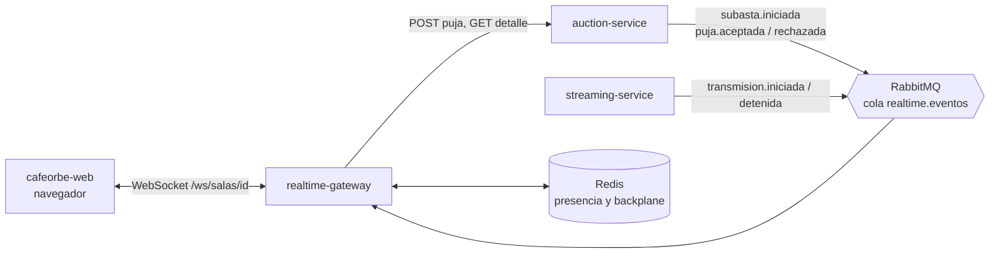
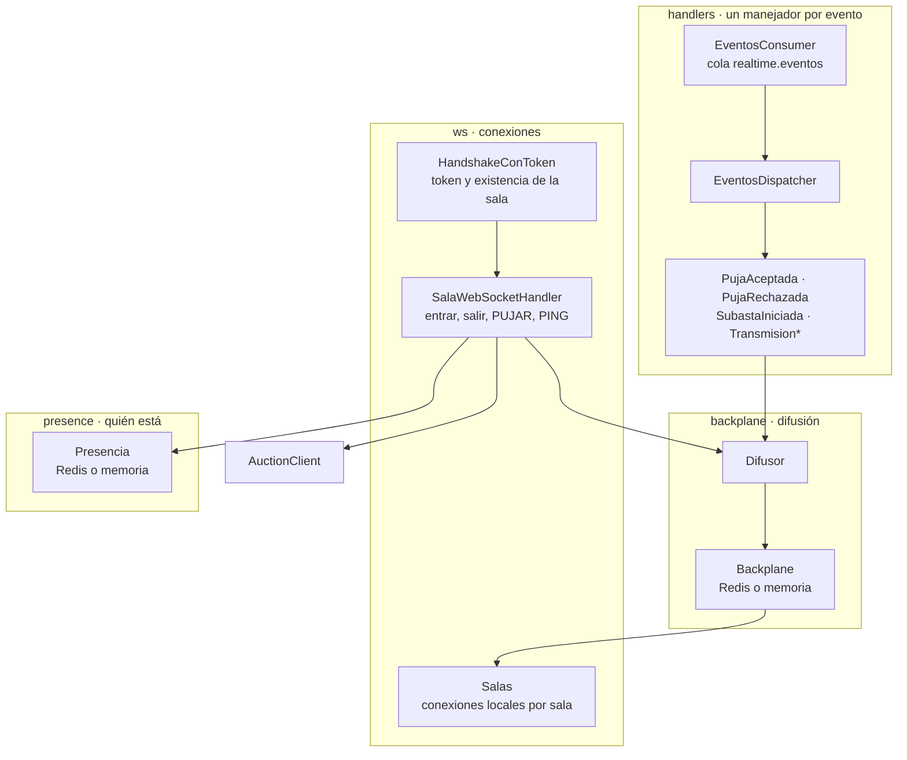
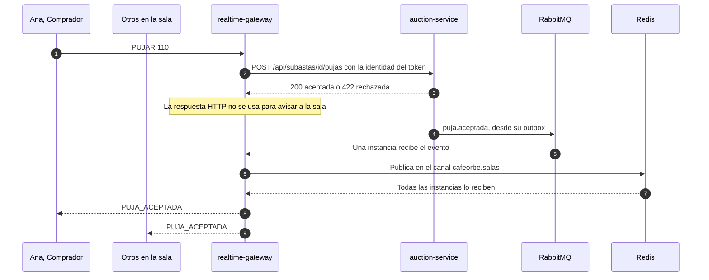
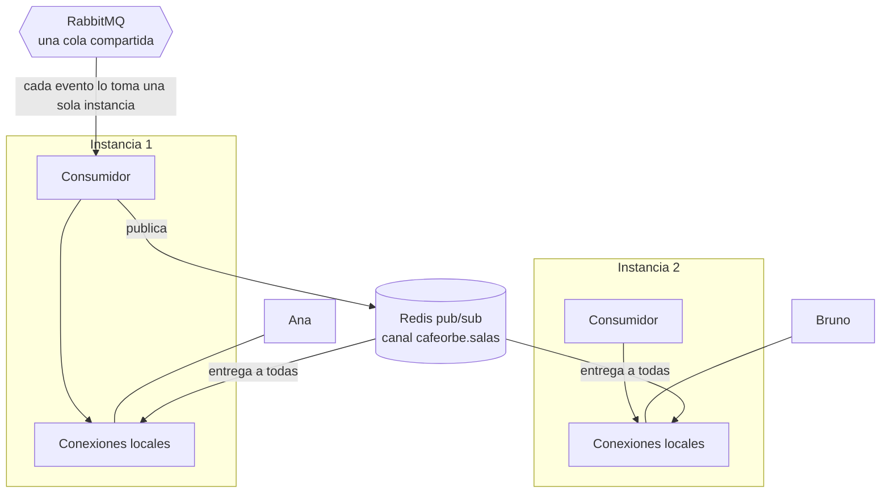
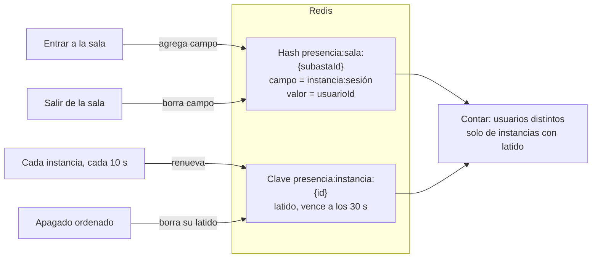
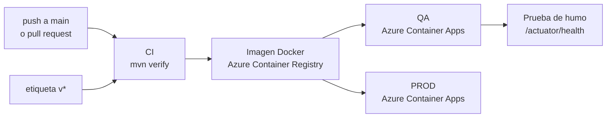

# cafeorbe-realtime-gateway

> El canal en vivo de CaféOrbe: mantiene una sala WebSocket por subasta y reparte a los conectados lo que pasa en ella. No decide nada; recibe hechos y los difunde.

| | |
|---|---|
| **Responsabilidad** | Conexiones WebSocket, difusión de eventos a la sala y conteo de conectados |
| **Estilo interno** | Orientado a eventos (publicación / suscripción) |
| **Stack** | Java 21 con hilos virtuales · Spring Boot 3.5 · Spring WebSocket · Redis · RabbitMQ |
| **Persistencia** | Ninguna base de datos. Redis para presencia y difusión entre instancias |
| **Puerto** | `8085` |
| **Historias** | HU-05, HU-11, HU-12, HU-13, HU-14 (difusión) y la base de HU-15 y HU-16 |
| **Consume** | `subasta.*`, `puja.*`, `transmision.*` |
| **Depende de** | auction-service (reenvío de pujas y existencia de la sala) |

## Contenido

1. [Contexto](#1-contexto)
2. [Arquitectura interna](#2-arquitectura-interna)
3. [Protocolo de la sala](#3-protocolo-de-la-sala)
4. [Flujo: de la puja a la pantalla](#4-flujo-de-la-puja-a-la-pantalla)
5. [Escalado horizontal](#5-escalado-horizontal)
6. [Presencia y conteo de conectados](#6-presencia-y-conteo-de-conectados)
7. [Decisiones de arquitectura](#7-decisiones-de-arquitectura)
8. [Atributos de calidad](#8-atributos-de-calidad)
9. [Configuración](#9-configuración)
10. [Ejecución y pruebas](#10-ejecución-y-pruebas)
11. [Despliegue](#11-despliegue)
12. [Riesgos conocidos y evolución](#12-riesgos-conocidos-y-evolución)

---

## 1. Contexto



El navegador se conecta **directo** a este servicio, sin pasar por el api-gateway: las conexiones largas tienen un patrón de escalado distinto al de las peticiones REST. El servicio valida el mismo token de sesión por su cuenta.

## 2. Arquitectura interna



| Paquete | Función |
|---|---|
| `ws` | Handshake, ciclo de vida de la conexión y mensajes del cliente |
| `handlers` | Consumo del broker: un manejador por tipo de evento decide a quién se difunde |
| `backplane` | Reparte cada mensaje a las conexiones de **todas** las instancias |
| `presence` | Registro compartido de quién está conectado a cada sala |
| `client` | Llamadas a auction-service |

`Backplane` y `Presencia` son interfaces con dos implementaciones: **Redis** (producción, varias instancias) y **memoria** (pruebas o una sola instancia). Se elige con `cafeorbe.realtime.modo`.

## 3. Protocolo de la sala

### Conexión

```text
ws://host:8085/ws/salas/{subastaId}?token={JWT}
```

El token viaja en la URL porque un navegador no puede enviar cabeceras al abrir un WebSocket. El handshake se rechaza antes de abrir la conexión si algo falla:

| HTTP | Cuándo |
|:-:|---|
| `400` | El id de la subasta no es un UUID |
| `401` | Token ausente, inválido o vencido |
| `404` | auction-service confirma que la subasta no existe |

Si auction-service no responde, se deja entrar: la sala carga su detalle por REST y el WebSocket se resincroniza al reconectar.

### Cliente → servidor

| Mensaje | Efecto |
|---|---|
| `{"tipo":"PUJAR","monto":110}` | Solo Comprador. Se reenvía a auction-service; el resultado llega como evento |
| `{"tipo":"PING"}` | Responde `PONG`. El cliente lo envía cada 25 s para mantener viva la conexión |

### Servidor → cliente

Todos los mensajes tienen la forma `{ "tipo", "subastaId", "datos" }`.

| `tipo` | Destinatario | Origen |
|---|---|---|
| `CONECTADOS` | Toda la sala | Alguien entra o sale |
| `SUBASTA_INICIADA` | Toda la sala | Evento `subasta.iniciada` |
| `PUJA_ACEPTADA` | Toda la sala | Evento `puja.aceptada` |
| `PUJA_RECHAZADA` | Solo quien pujó | Evento `puja.rechazada` |
| `TRANSMISION_INICIADA` / `TRANSMISION_DETENIDA` | Toda la sala | Eventos `transmision.*` |
| `ERROR` | Solo quien lo causó | Mensaje inválido, rol sin permiso o auction caído |
| `PONG` | Solo quien envió `PING` | |

## 4. Flujo: de la puja a la pantalla

El servicio no valida la puja ni conoce las reglas: la entrega a auction-service y espera el hecho consumado.



Que el resultado llegue **por evento y no por la respuesta HTTP** es deliberado: todos los conectados, incluido quien pujó, se enteran por el mismo camino y en el mismo orden. Medido en vivo, de la puja a la pantalla de los demás pasan unos 200 ms.

## 5. Escalado horizontal

Un WebSocket queda atado a la instancia que lo aceptó. Con varias instancias, los conectados a una misma sala están repartidos y un evento debe llegar a todos.



- **Una cola compartida**, no una por instancia: cada evento se procesa una sola vez y se republica en Redis.
- **Redis pub/sub como backplane:** todas las instancias, incluida la que publicó, reciben el mensaje y lo entregan a sus conexiones locales de esa sala.
- **Un consumidor por instancia** (`concurrency: 1`) para conservar el orden de los eventos de una sala.
- **Envíos protegidos:** cada conexión se envuelve en un decorador que serializa los envíos y corta al cliente que no consume (límite de 5 s o 64 KB en cola). Un cliente lento no frena a los demás.

## 6. Presencia y conteo de conectados

El conteo cuenta **personas distintas**, no pestañas: quien abre la sala dos veces cuenta una vez.



El problema que resuelve el latido: si una instancia se reinicia o se cae, sus conexiones mueren sin pasar por la salida normal. Sin protección quedarían como **conectados fantasma**.

| Situación | Comportamiento |
|---|---|
| Un usuario sale normalmente | Se borra su campo y se difunde el nuevo conteo |
| La instancia se apaga de forma ordenada (despliegue) | Retira su latido antes de cerrar Redis; sus conexiones dejan de contar de inmediato |
| La instancia se cae sin avisar | Su latido vence en 30 s; a partir de ahí sus conexiones se descartan |
| Limpieza | Al contar, los campos de instancias sin latido se borran del hash |

El hash de cada sala expira solo tras 6 horas sin actividad.

## 7. Decisiones de arquitectura

| Decisión | Motivo | Costo aceptado |
|---|---|---|
| Servicio separado del api-gateway | Conexiones largas con estado frente a peticiones cortas sin estado: escalan y fallan distinto | El token se valida en dos lugares |
| El servicio no decide nada | Una sola fuente de verdad (auction). Realtime puede reiniciarse sin perder datos de negocio | Un salto más para cada puja |
| El resultado de la puja llega por evento | Mismo camino y mismo orden para todos los conectados | Depende de que el broker esté arriba para ver el resultado |
| Redis pub/sub como backplane | Simple y suficiente para difundir a pocas instancias | Sin persistencia: un mensaje publicado mientras una instancia reconecta a Redis se pierde |
| Reconexión con resincronización en el cliente | Compensa lo anterior: al reconectar, el frontend vuelve a pedir el detalle por REST | Una petición extra en cada reconexión |
| Hilos virtuales | Muchas conexiones concurrentes con código bloqueante simple | Requiere Java 21 |
| Latido por instancia en lugar de por conexión | Una escritura cada 10 s por instancia, no por usuario conectado | Hasta 30 s de conteo inflado tras una caída abrupta |

## 8. Atributos de calidad

| Atributo | Cómo se logra |
|---|---|
| **Latencia** | Difusión de una puja en unos 200 ms, medida de extremo a extremo |
| **Escalabilidad** | Instancias intercambiables; el estado compartido vive en Redis |
| **Resiliencia** | Un evento ilegible se descarta en lugar de reintentarse sin fin. Un cliente lento se desconecta sin afectar a la sala |
| **Seguridad** | Token validado en el handshake; orígenes restringidos; solo un Comprador puede pujar; un rechazo solo lo ve quien pujó |
| **Operabilidad** | `GET /actuator/health`. El chequeo no incluye a Redis: un corte de Redis no marca la instancia como caída |

## 9. Configuración

| Variable | Por defecto | Uso |
|---|---|---|
| `REDIS_HOST` `REDIS_PORT` `REDIS_PASSWORD` | `localhost:6379` | Presencia y backplane |
| `RABBIT_HOST` `RABBIT_PORT` `RABBIT_USER` `RABBIT_PASSWORD` | `localhost:5672` | Broker de eventos |
| `RABBIT_VHOST` `RABBIT_SSL` | `/` · `false` | Broker gestionado con TLS |
| `AUCTION_URL` | `http://localhost:8082` | Reenvío de pujas y verificación de la sala |
| `JWT_SECRET` | valor de desarrollo | El mismo que identity y api-gateway |
| `CORS_ORIGINS` | `http://localhost:5173` | Orígenes permitidos para abrir el WebSocket |

`cafeorbe.realtime.modo`: `redis` (por defecto) o `memoria`.

## 10. Ejecución y pruebas

Requiere **Java 21** y el módulo `cafeorbe-contracts` instalado (`mvn install` en ese repositorio).

```bash
mvn spring-boot:run      # necesita RabbitMQ, Redis y auction-service: ver cafeorbe-infra
mvn test                 # 17 pruebas, sin infraestructura
```

| Suite | Pruebas | Qué verifica |
|---|:-:|---|
| `SalaWebSocketTest` | 12 | Un cliente WebSocket real contra el servicio: handshake, presencia, difusión por sala, rechazo privado, reenvío de pujas |
| `PresenciaRedisTest` | 5 | Conteo entre instancias, instancia caída, apagado ordenado |

## 11. Despliegue



El pipeline (`.github/workflows/ci.yml`) despliega en QA con cada cambio en `main` y en PROD con una etiqueta `v*`. En Azure usa un Redis gestionado y permite como origen el frontend desplegado.

## 12. Riesgos conocidos y evolución

| Riesgo o deuda | Impacto | Acción propuesta |
|---|---|---|
| El token viaja en la URL | Puede quedar en registros de acceso de proxies o balanceadores | Token de un solo uso y vida corta para abrir el WebSocket |
| El token solo se valida al conectar | Una conexión abierta sigue viva después de que el token vence | Cerrar la conexión al vencer el token |
| Varias instancias compiten por la misma cola | El orden entre eventos de una misma sala no está garantizado entre instancias | Encaminar por sala (consistent hashing) si el volumen lo exige |
| Redis pub/sub no persiste | Un mensaje puede perderse durante un corte de Redis | Mitigado con la resincronización del cliente; Redis Streams si se necesita garantía |
| En la nube, `AUCTION_URL` apuntaba a un nombre `.internal.` que no existe en el ambiente | Las pujas enviadas por WebSocket no llegaban a auction | Corregido y verificado en QA: `https` con el nombre real de la aplicación |
| En la nube, Redis se usa sin TLS (puerto 6379) | La contraseña viaja sin cifrar | Puerto TLS 6380 |
| Sin límite de mensajes por conexión | Un cliente puede enviar `PUJAR` en ráfaga | Límite de frecuencia por usuario |

**Sprint 2:** nuevos manejadores para `subasta.cerrada` (anuncio del ganador, HU-21), `tiempo.extendido` (anti-sniping, HU-18) y `orbes.cobrados` (refresco de saldo, HU-20). Agregar un evento es agregar una clase que implemente `ManejadorDeEvento`.
